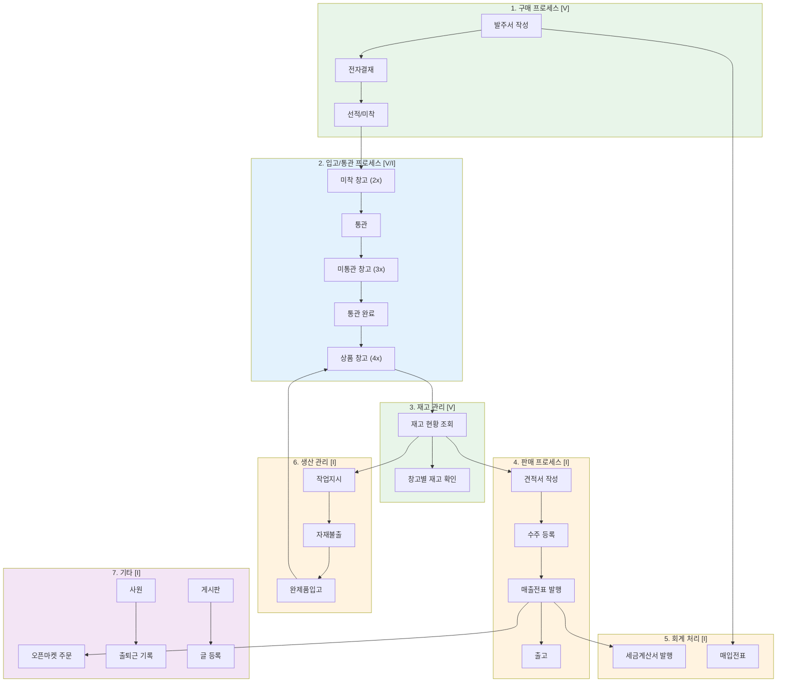
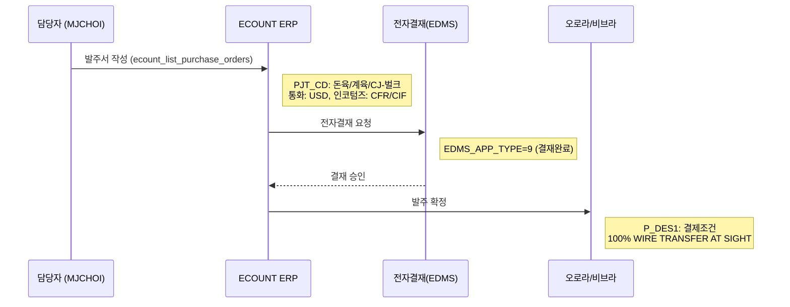

# ECOUNT ERP 업무 플로우 — 수입육 유통

> 수집일: 2026-03-24 | 신뢰도 범례: `[V]` VERIFIED, `[I]` INFERRED, `[U]` UNKNOWN

## 전체 업무 흐름도



**색상 범례**: 녹색 = VERIFIED (실데이터 확인), 주황 = INFERRED (스키마 추론), 보라 = INFERRED (독립 기능)

---

## 1. 구매 프로세스 `[VERIFIED]`

실서버 API에서 조회된 발주 데이터 **30건(2024-11 ~ 2025-09)** 기반 업무 흐름입니다.



### 발주 데이터에서 확인된 패턴 (30건 분석)

| 패턴 | 증거 |
|------|------|
| 주 거래처: 오로라 (10001) | 30건 중 21건(70%)이 오로라 |
| 보조 거래처: 비브라 | 30건 중 9건(30%), 계육 전문 |
| 외화거래 (USD) | FOREIGN_FLAG=1, EXCHANGE_TYPE=00001 |
| 프로젝트별 관리 | 돈육(00007) 10건, 계육(00003) 15건, CJ벌크(00008) 5건 |
| 계육 비중 증가 추세 | 2025-07 이후 비브라 계육 발주 활발 |
| 전자결재 완료 후 확정 | EDMS_APP_TYPE=9 (전체 발주) |
| 작성자 고정 | WRITER_ID=MJCHOI (전체 발주) |
| 발주 주기 | 월 1~8건, 4월에 대량(8건 $3.57M) |

### 전체 발주 규모 (2024-11 ~ 2025-09)

| 구분 | 값 |
|------|-----|
| 총 발주 건수 | 30건 |
| 총 발주 수량 | 약 2,417톤 (2,417,270 KG) |
| 총 발주 금액 | $6,805,565 (USD) |
| 월 평균 발주 | 4.3건 / $972,224 |

### 거래처별 역할 분담

| 거래처 | 주요 역할 | 발주 비중 | 핵심 품목 |
|--------|----------|----------|-----------|
| 오로라 | 돈육+계육 종합 공급사 | 70% (21건, $6.1M) | 목살, 전지(벌크), 삼겹, 닭다리살 |
| 비브라 | 계육 전문 공급사 | 30% (9건, $0.5M) | 닭발, 닭다리살, 조각정육 |

### 품목 카테고리별 분석

| 카테고리 | 발주 건수 | 주요 품목 | 특징 |
|----------|----------|----------|------|
| 돈육 | 10건 | 목살, 삼겹 | 오로라 단독, 단가 $3.5~3.9/kg |
| CJ-벌크 | 5건 | 전지 (벌크) | 오로라 단독, 대량(1건 35만kg), 단가 $2.6~3.1/kg |
| 계육 | 15건 | 닭다리살, 닭발, 사이즈정육 | 오로라+비브라, 단가 $0.8~2.6/kg |

---

## 2. 재고/물류 프로세스 `[VERIFIED]`

창고별 재고 데이터로 확인된 물류 흐름입니다.


### 품목 12404 (돈육 목살) 물류 현황

| 단계 | 창고 | 수량 (KG) | 비율 | 상태 |
|------|------|----------|------|------|
| 미착 | 22 (미착_삼진2) | 69,073 | 38.5% | 선적 후 운송중 |
| 미통관 | 32 (미통관_삼진2) | 23,017 | 12.8% | 도착, 통관 대기 |
| 상품 | 42 (상품_삼진2냉장) | 87,485 | 48.7% | 판매 가능 |
| **합계** | | **179,575** | **100%** | |

### 물류 단계 해석
- **48.7%가 상품 창고**: 판매 가능 재고가 절반 가량
- **38.5%가 미착**: 다수의 물량이 운송 중
- **12.8%가 미통관**: 통관 절차 대기 중

---

## 3. 판매 프로세스 `[INFERRED]`

> Save 도구(ecount_save_quotation, ecount_save_sale_order, ecount_save_sale) 스키마에서 추론


### 견적→수주→매출 데이터 흐름 (스키마 기반 추론)

| 단계 | 도구 | 핵심 필드 | 흐름 |
|------|------|----------|------|
| 견적 | `save_quotation` | CUST, PROD_CD, QTY, PRICE | 가격/수량 제시 |
| 수주 | `save_sale_order` | CUST, PROD_CD, QTY, WH_CD | 주문 확정, 출고창고 지정 |
| 매출 | `save_sale` | CUST, PROD_CD, QTY, WH_CD, IO_TYPE | 실제 출고, 거래유형 지정 |
| 계산서 | `save_invoice_auto` | CUST, UPLOAD_SER_NO | 매출전표 기반 자동 발행 |

### 판매 프로세스에서 사용되는 공통 키

| 키 | 역할 | 연결 엔티티 |
|----|------|------------|
| CUST | 거래처 | CUSTOMER 마스터 |
| PROD_CD | 품목 | PRODUCT 마스터 |
| WH_CD | 출고창고 | WAREHOUSE (4x 상품창고) |
| UPLOAD_SER_NO | 전표번호 | 견적→수주→매출 추적 |

---

## 4. 생산 프로세스 `[INFERRED]`

> Save 도구(ecount_save_job_order, ecount_save_goods_issued, ecount_save_goods_receipt) 스키마에서 추론


| 단계 | 도구 | 핵심 필드 | 의미 |
|------|------|----------|------|
| 작업지시 | `save_job_order` | PROD_CD, QTY, WH_CD, EMP_CD | 생산 계획 수립 |
| 자재불출 | `save_goods_issued` | PROD_CD, QTY, WH_CD | 원자재 출고 |
| 완제품입고 | `save_goods_receipt` | PROD_CD, QTY, WH_CD | 완성품 입고 |

---

## 5. 회계 프로세스 `[INFERRED]`

| 구분 | 도구 | 설명 |
|------|------|------|
| 매입전표 | `save_purchase` | 구매 거래 회계 처리 |
| 세금계산서 | `save_invoice_auto` | 매출/매입 세금계산서 자동 발행 |

---

## 6. 기타 업무 `[INFERRED]`

| 업무 | 도구 | 용도 |
|------|------|------|
| 오픈마켓 | `save_open_market_order` | 외부 쇼핑몰 주문 ERP 연동 |
| 근태관리 | `save_clock_in_out` | 출퇴근 기록 |
| 게시판 | `create_board` | 사내 게시판 (V3 API) |

---

## 업무 흐름 요약 — 수입육 유통 전체 사이클

```
[해외 공급사] → 발주(PO) → 선적 → 미착창고(2x) → 도착 → 미통관창고(3x)
                                                            ↓
[국내 고객] ← 매출전표 ← 출고 ← 상품창고(4x) ← 통관완료
                ↓
          세금계산서 발행
```

| 전체 사이클 단계 | 관찰 가능 여부 | MCP 도구 |
|----------------|---------------|----------|
| 1. 발주서 작성 | `[V]` 조회+저장 | list_purchase_orders |
| 2. 선적/미착 | `[V]` 재고로 확인 | list_inventory_by_location |
| 3. 통관 | `[V]` 재고로 확인 | list_inventory_by_location |
| 4. 상품 입고 | `[V]` 재고로 확인 | list_inventory_balance |
| 5. 견적/수주 | `[I]` 저장만 가능 | save_quotation, save_sale_order |
| 6. 매출/출고 | `[I]` 저장만 가능 | save_sale |
| 7. 세금계산서 | `[I]` 저장만 가능 | save_invoice_auto |
| 8. 매입전표 | `[I]` 저장만 가능 | save_purchase |
