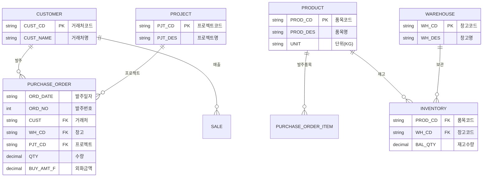
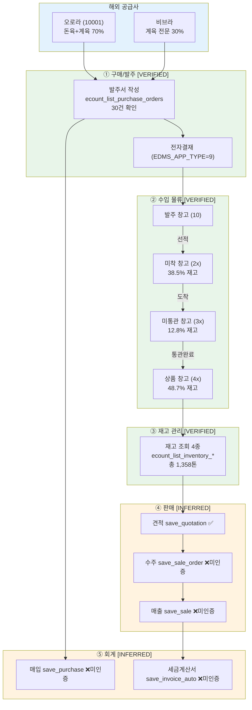

# ECOUNT ERP MCP Server — 데이터 흐름 및 업무 플로우 종합

> 최종 업데이트: 2026-03-24 | COM_CODE: 635188 | Zone: AA
> 실서버 API 검증 완료 | 발주서 30건 실데이터 기반

---

## 1. 시스템 아키텍처

```
┌─────────────────────────────────────────────────────────────────┐
│                     Claude Desktop / Claude Code                │
│                        (AI 클라이언트)                            │
└──────────────────────────┬──────────────────────────────────────┘
                           │ MCP Protocol (stdio)
                           ▼
┌─────────────────────────────────────────────────────────────────┐
│                    astrosECOUNT MCP Server                      │
│  ┌──────────┐  ┌──────────────┐  ┌───────────────────────┐     │
│  │ server.ts │→│ tool-factory  │→│ 23개 MCP 도구 등록      │     │
│  │          │  │ (Save/Query)  │  │ connection(3) master(4)│     │
│  │ McpServer│  └──────┬───────┘  │ sales(3) purchase(2)   │     │
│  │ v1.0.0   │         │          │ inventory(4) prod(3)   │     │
│  └──────────┘         │          │ accounting(1) other(2) │     │
│                       │          │ board(1)               │     │
│  ┌────────────────────▼───────────────────────────────────┐     │
│  │              EcountClient                               │    │
│  │  ┌──────────────────┐  ┌────────────────────────┐      │    │
│  │  │ SessionManager   │  │ post() / postRaw()     │      │    │
│  │  │ - auto login     │  │ - V2 API: /OAPI/V2/... │      │    │
│  │  │ - session cache  │  │ - V3 API: /ec5/api/... │      │    │
│  │  │ - auto refresh   │  │ - session retry (1회)  │      │    │
│  │  │ - deduplication  │  │ - 30s timeout          │      │    │
│  │  └──────────────────┘  └────────────────────────┘      │    │
│  └─────────────────────────────────────────────────────────┘    │
└──────────────────────────┬──────────────────────────────────────┘
                           │ HTTPS (REST API)
                           ▼
┌─────────────────────────────────────────────────────────────────┐
│                   ECOUNT ERP Cloud Server                       │
│  Production: oapi{ZONE}.ecount.com                              │
│  Sandbox:    sboapi{ZONE}.ecount.com                            │
│                                                                 │
│  V2 API: /OAPI/V2/{Category}/{Method}?SESSION_ID=...           │
│  V3 API: /ec5/api/app.oapi.v3/action/{Action}?session_Id=...  │
└─────────────────────────────────────────────────────────────────┘
```

### MCP 도구 처리 흐름 (Save vs Query)

```
[Save 도구 호출]                              [Query 도구 호출]
     │                                              │
     ▼                                              ▼
{ ListKey: [{BulkDatas: params}] }           params 직접 전달
     │                                              │
     ├──── 래퍼키 매핑 ────────┐                     │
     │  CustList (거래처)      │                     │
     │  ProductList (품목)     │                     │
     │  QuotationList (견적)   │                     │
     │  SaleOrderList (수주)   │                     │
     │  SaleList (매출)        │                     │
     │  PurchaseList (매입)    │                     │
     │  JobOrderList (작업지시) │                    │
     │  GoodsIssuedList (불출) │                     │
     │  GoodsReceiptList (입고)│                     │
     │  InvoiceAutoList (회계) │                     │
     └────────────────────────┘                     │
     ▼                                              ▼
  EcountClient.post(endpoint, body)
     │
     ▼
  SessionManager.getSessionId()  ←── 세션 없으면 자동 로그인
     │                                (Promise deduplication)
     ▼
  HTTPS POST → ECOUNT API
     │
     ▼
  응답 처리: Status 200 → Data 반환
             세션 만료  → 재로그인 후 1회 재시도
             에러       → EcountApiError throw
```

---

## 2. 데이터 엔티티 관계



### 확인된 코드 체계

| 구분 | 코드 | 명칭 | 비고 |
|------|------|------|------|
| **거래처** | 10001 | 오로라 | 돈육+계육 종합 (70%) |
| **거래처** | 000-00-00046 | 비브라 | 계육 전문 (30%) |
| **프로젝트** | 00007 | 수입육 (돈육) | 목살, 삼겹 |
| **프로젝트** | 00008 | 수입육 (CJ-벌크) | 전지 벌크, 대량 |
| **프로젝트** | 00003 | 수입육 (계육) | 닭다리살, 닭발 |
| **창고** | 10 | 발주 창고 | 발주 시 기본 |
| **창고** | 2x | 미착 창고 | 선적 후 운송중 |
| **창고** | 3x | 미통관 창고 | 도착, 통관 대기 |
| **창고** | 4x | 상품 창고 | 통관 완료, 판매 가능 |
| **통화** | 00001 | USD | 전체 외화거래 |
| **인코텀즈** | - | CFR, CIF | 해상운송 조건 |

---

## 3. 수입육 유통 업무 플로우 (End-to-End)

```
━━━━━━━━━━━━━━━━━━━━━━━━━━━━━━━━━━━━━━━━━━━━━━━━━━━━━━━━━━━━━━━━
 해외 공급사                ECOUNT ERP                  국내 고객
━━━━━━━━━━━━━━━━━━━━━━━━━━━━━━━━━━━━━━━━━━━━━━━━━━━━━━━━━━━━━━━━

 오로라/비브라
     │
     │  ① 발주서 작성 ──→ [발주 창고 10] ──→ 전자결재(EDMS)
     │     MJCHOI 작성       USD 외화           결재완료=9
     │     PJT: 돈육/계육/CJ벌크
     │
     │  ② 선적 ────────→ [미착 창고 2x] ─────── 38.5% 재고
     │     CFR/CIF            운송중
     │     WIRE TRANSFER
     │
     │  ③ 도착 ────────→ [미통관 창고 3x] ───── 12.8% 재고
     │                        통관 대기
     │
     │  ④ 통관완료 ────→ [상품 창고 4x] ─────── 48.7% 재고
     │                        판매 가능
     │                            │
     │                            ▼
     │                   ⑤ 견적→수주→매출        ──→ 국내 고객
     │                        출고                    매출전표
     │                            │
     │                            ▼
     │                   ⑥ 세금계산서 발행
     │                        매입/매출 회계처리
━━━━━━━━━━━━━━━━━━━━━━━━━━━━━━━━━━━━━━━━━━━━━━━━━━━━━━━━━━━━━━━━
```

### 단계별 MCP 도구 매핑

| 단계 | 업무 | MCP 도구 | API 상태 | 데이터 신뢰도 |
|------|------|----------|----------|--------------|
| ① 발주 | 발주서 작성/조회 | `ecount_list_purchase_orders` | ✅ 실서버 인증 | `[VERIFIED]` 30건 |
| ② 선적 | 미착 재고 확인 | `ecount_list_inventory_by_location` | ✅ 실서버 인증 | `[VERIFIED]` |
| ③ 통관 | 미통관 재고 확인 | `ecount_view_inventory_by_location` | ✅ 실서버 인증 | `[VERIFIED]` |
| ④ 입고 | 상품 재고 확인 | `ecount_list_inventory_balance` | ✅ 실서버 인증 | `[VERIFIED]` |
| ⑤ 판매 | 견적/수주/매출 | `ecount_save_quotation` 등 | ❌ 수주/매출 미인증 | `[INFERRED]` |
| ⑥ 회계 | 세금계산서 | `ecount_save_invoice_auto` | ❌ 미인증 | `[INFERRED]` |

---

## 4. API 현황 매트릭스

### 실서버 사용 가능 여부 (2026-03-24 검증)

```
            ┌────────┐  ┌────────┐  ┌────────┐
            │  저장   │  │  조회   │  │ 실서버  │
            │ (Save) │  │(Query) │  │  상태   │
  ──────────┼────────┼──┼────────┼──┼────────┤
  품목       │  ✅    │  │  ✅✅  │  │ 완전   │  ← 등록+조회+목록
  재고       │  -     │  │  ✅✅✅✅│  │ 완전   │  ← 4종 조회
  발주       │  -     │  │  ✅    │  │ 조회만  │  ← 목록 조회
  거래처      │  ✅    │  │  ❌    │  │ 저장만  │  ← 조회 API 없음
  견적       │  ✅    │  │  ❌    │  │ 저장만  │  ← 조회 API 없음
  수주       │  ❌    │  │  ❌    │  │ 불가   │  ← API 미인증
  매출       │  ❌    │  │  ❌    │  │ 불가   │  ← API 미인증
  매입       │  ❌    │  │  ❌    │  │ 불가   │  ← API 미인증
  생산 (3종)  │  ❌    │  │  ❌    │  │ 불가   │  ← API 미인증
  회계       │  ❌    │  │  ❌    │  │ 불가   │  ← API 미인증
  근태       │  ✅    │  │  ❌    │  │ 저장만  │
  게시판      │  ✅    │  │  ❌    │  │ 저장만  │
  ──────────┴────────┴──┴────────┴──┴────────┘

  ✅ 인증완료   ❌ 미인증/미존재   - 해당없음
```

### 조회 가능 데이터 vs 불가 데이터

| 구분 | 조회 가능 (VERIFIED) | 조회 불가 (INFERRED) |
|------|---------------------|---------------------|
| **마스터** | 품목 목록/상세 (29건) | 거래처 목록 (API 미존재) |
| **거래** | 발주서 목록 (30건+) | 견적, 수주, 매출, 매입 목록 |
| **재고** | 재고현황 4종 (23건, 1,358톤) | - |
| **생산** | - | 작업지시, 불출, 입고 |
| **회계** | - | 전표, 세금계산서 |

---

## 5. 실데이터 기반 비즈니스 인사이트

### 발주 데이터 분석 (30건, 2024-11 ~ 2025-09)

| 지표 | 값 |
|------|-----|
| 총 발주 건수 | 30건 |
| 총 발주 수량 | **2,417톤** (2,417,270 KG) |
| 총 발주 금액 | **$6,805,565** (USD) |
| 월 평균 발주 | 4.3건 / $972K |
| 최대 발주월 | 2025-04 (8건, $3.57M) |
| 주요 거래처 | 오로라 70%, 비브라 30% |

### 거래처별 포지셔닝

```
                  돈육                    계육
            ┌─────────────────────────────────────┐
  오로라     │ 목살, 삼겹, 전지(벌크)  │  닭다리살, 사이즈정육  │
  (70%)     │ $3.5~3.9/kg          │  $2.2~2.6/kg         │
            │ 10건 + CJ벌크 5건     │  6건                  │
            ├─────────────────────────────────────┤
  비브라     │         -             │  닭발, 닭다리살, 조각정육│
  (30%)     │                       │  $0.8~2.6/kg          │
            │                       │  9건                   │
            └─────────────────────────────────────┘
```

### 재고 현황 (총 1,358톤)

| 물류 단계 | 비율 | 수량 (KG) | 의미 |
|----------|------|----------|------|
| 상품 창고 (4x) | 48.7% | ~661,300 | 판매 가능 |
| 미착 창고 (2x) | 38.5% | ~522,800 | 해상 운송중 |
| 미통관 창고 (3x) | 12.8% | ~173,800 | 통관 대기 |

### 품목 카테고리 현황 (29건 등록)

| 카테고리 | 주요 품목 | 수량 단위 | 비고 |
|----------|----------|----------|------|
| 수입 돈육 | 목살, 삼겹, 전지(벌크), 로인립, 목뼈 | KG | 8개 품목 등록 |
| 수입 계육 | 닭다리살, 닭발, 사이즈정육, 조각정육, 근위 | KG | 추정 다수 |
| 사료 원료 | FlakesMix, FlockMix | KG | 2개 품목 |

---

## 6. 데이터 흐름 다이어그램 (Mermaid)



---

## 7. MCP 서버 설정 주의사항

### 현재 config.ts 요구 환경 변수

```env
ECOUNT_COM_CODE=635188        # 필수
ECOUNT_USER_ID=CHSHIN         # 필수 (config.ts에 _PROD 접미사 미지원)
ECOUNT_API_CERT_KEY=<키>       # 필수 (config.ts에 _PROD 접미사 미지원)
ECOUNT_ZONE=AA                # 필수 (기본값: AU1)
ECOUNT_LAN_TYPE=ko-KR         # 선택 (기본값: ko-KR)
ECOUNT_API_MODE=production    # 선택 (production|sandbox, 기본값: production)
```

> **주의**: 현재 `.env`에는 `ECOUNT_USER_ID_PROD`, `ECOUNT_API_CERT_KEY_PROD` 등 접미사 키만 있고,
> `ECOUNT_USER_ID`, `ECOUNT_API_CERT_KEY`가 없어 MCP 서버 시작이 불가합니다.
> Claude Desktop config에 직접 지정하거나, `.env`에 기본 키를 추가해야 합니다.

### API Rate Limit

| 제한 | 값 | 영향 |
|------|-----|------|
| 저장 API | 1회/10초 | Save 도구 연속 호출 시 제한 |
| 조회 API | 1회/1초 | Query 도구 빈번 호출 시 제한 |
| 로그인/Zone | 1회/10분 | 세션 재발급 제한 |
| 시간당 연속 오류 | 30건 | 오류 누적 시 차단 |
| 1일 최대 | 5,000건 | 대량 자동화 시 주의 |
| 발주서 조회 기간 | 최대 31일 | 월별 분할 조회 필요 |

### Rate Limit 대응

- rate limit 초과 시 HTML 응답 반환 (JSON 파싱 실패)
- 대량 조회 시 월별 분할 + 1.5초 이상 간격 필요
- 하루 동안의 API 호출이 누적되므로 검증 스크립트 실행 후 여유시간 필요

---

## 8. 조치 필요 사항

### P0 (즉시): ECOUNT 관리자에서 API 인증 추가

ECOUNT ERP → 시스템관리 → API인증현황에서 아래 API 권한 추가:

| 우선순위 | API | 업무 영향 |
|----------|-----|----------|
| **필수** | SaveSaleOrder (수주) | 판매 프로세스 시작점 |
| **필수** | SaveSale (매출) | 출고/매출 처리 |
| **필수** | SavePurchases (매입) | 구매 회계 처리 |
| 선택 | SaveJobOrder (작업지시) | 생산 관리 시 |
| 선택 | SaveGoodsIssued (생산불출) | 생산 관리 시 |
| 선택 | SaveGoodsReceipt (생산실적) | 생산 관리 시 |
| 선택 | SaveInvoiceAuto (회계전표) | 세금계산서 자동화 시 |

### P1 (단기): MCP 서버 설정 수정

- `.env`에 `ECOUNT_USER_ID` 및 `ECOUNT_API_CERT_KEY` 기본 키 추가
- 또는 `config.ts`에서 `_PROD` 접미사 키 우선 참조 로직 추가

### P2 (중기): 미수집 발주서 데이터 보완

- rate limit 해소 후 미수집 월 재조회:
  - 2024-01~10, 2024-12
  - 2025-01~03, 2025-10~12
  - 2026-01~03

---

## 9. 문서 인덱스

| 문서 | 내용 |
|------|------|
| [00-setup-operations.md](00-setup-operations.md) | 환경 설정, 세션 관리, Claude Desktop 연동 |
| [01-data-catalog.md](01-data-catalog.md) | 품목 29건, 재고 1,358톤, 발주서 30건 상세 |
| [02-entity-relationship.md](02-entity-relationship.md) | ERD, 엔티티 관계, 코드 체계 |
| [03-business-workflow.md](03-business-workflow.md) | 업무 플로우 (구매→물류→재고→판매→회계) |
| [04-tool-reference.md](04-tool-reference.md) | MCP 도구 23개 상세 레퍼런스 |
| [05-api-coverage-gap.md](05-api-coverage-gap.md) | API 검증 결과, 인증 상태, 갭 분석 |
| **[06-data-flow-summary.md](06-data-flow-summary.md)** | **본 문서 — 종합 데이터 흐름** |
