# ECOUNT ERP 엔티티 관계도

> 수집일: 2026-03-24 | 신뢰도 범례: `[V]` VERIFIED, `[I]` INFERRED, `[U]` UNKNOWN

## 전체 ERD (Mermaid)

```mermaid
erDiagram
    CUSTOMER ||--o{ PURCHASE_ORDER : "발주"
    CUSTOMER ||--o{ QUOTATION : "견적"
    CUSTOMER ||--o{ SALE_ORDER : "수주"
    CUSTOMER ||--o{ SALE : "매출"
    CUSTOMER ||--o{ PURCHASE : "매입"

    PRODUCT ||--o{ PURCHASE_ORDER_ITEM : "발주품목"
    PRODUCT ||--o{ INVENTORY : "재고"
    PRODUCT ||--o{ SALE_ITEM : "매출품목"
    PRODUCT ||--o{ QUOTATION_ITEM : "견적품목"
    PRODUCT ||--o{ JOB_ORDER_ITEM : "작업지시품목"

    WAREHOUSE ||--o{ INVENTORY : "보관"
    WAREHOUSE ||--o{ PURCHASE_ORDER : "입고창고"

    PROJECT ||--o{ PURCHASE_ORDER : "프로젝트"

    PURCHASE_ORDER ||--o{ PURCHASE_ORDER_ITEM : "품목상세"
    PURCHASE_ORDER }|--|| EDMS : "전자결재"

    SALE ||--o{ SALE_ITEM : "품목상세"
    SALE ||--o{ INVOICE : "세금계산서"

    JOB_ORDER ||--o{ JOB_ORDER_ITEM : "품목상세"
    JOB_ORDER ||--o{ GOODS_ISSUED : "자재불출"
    JOB_ORDER ||--o{ GOODS_RECEIPT : "완제품입고"

    EMPLOYEE ||--o{ CLOCK_IN_OUT : "출퇴근"
    EMPLOYEE ||--o{ PURCHASE_ORDER : "담당자"

    BOARD ||--o{ BOARD_POST : "게시글"

    CUSTOMER {
        string BUSINESS_NO PK "[V] 사업자번호"
        string CUST_NAME "[V] 거래처명"
        string CUST_CD "[V] 거래처코드"
    }

    PRODUCT {
        string PROD_CD PK "[V] 품목코드"
        string PROD_DES "[V] 품목명"
        string UNIT "[V] 단위"
        string PROD_TYPE "[V] 품목유형"
        string CLASS_CD "[V] 분류코드"
        string BAL_FLAG "[V] 재고관리여부"
        string CONT1 "[V] 영문스펙"
    }

    WAREHOUSE {
        string WH_CD PK "[V] 창고코드"
        string WH_DES "[V] 창고명"
    }

    PROJECT {
        string PJT_CD PK "[V] 프로젝트코드"
        string PJT_DES "[V] 프로젝트명"
    }

    INVENTORY {
        string PROD_CD FK "[V] 품목코드"
        string WH_CD FK "[V] 창고코드"
        decimal BAL_QTY "[V] 재고수량"
    }

    PURCHASE_ORDER {
        string ORD_DATE "[V] 발주일자"
        int ORD_NO "[V] 발주번호"
        string CUST FK "[V] 거래처코드"
        string WH_CD FK "[V] 창고코드"
        string PJT_CD FK "[V] 프로젝트코드"
        string EXCHANGE_TYPE "[V] 외화종류"
        string P_DES2 "[V] 인코텀즈"
        decimal QTY "[V] 수량"
        decimal BUY_AMT_F "[V] 외화금액"
    }

    QUOTATION {
        string CUST FK "[V] 거래처코드"
        string PROD_CD FK "[V] 품목코드"
        decimal QTY "[V] 수량"
        decimal PRICE "[I] 단가"
    }

    SALE_ORDER {
        string CUST FK "[V] 거래처코드"
        string PROD_CD FK "[V] 품목코드"
        decimal QTY "[V] 수량"
        string WH_CD FK "[V] 출고창고"
    }

    SALE {
        string DATA_DT "[V] 전표일자"
        string DATA_NO "[V] 전표번호"
        string CUST FK "[V] 거래처코드"
        string CUST_NM "[V] 판매처명"
        string PROD_SUMMARY "[V] 품명요약"
        decimal QTY "[V] 수량(KG)"
        decimal SUPPLY_AMT "[V] 공급가액"
        decimal VAT_AMT "[V] 부가세액"
        string WH_CD FK "[V] 출고창고"
        string TRX_TYPE_CD "[V] 거래유형(12=면세)"
        string PJT_CD FK "[V] 프로젝트코드"
        string WRITE_SID "[V] 작성자"
        string CONN_ACC_SLIP "[V] 회계반영여부"
        string CONFIRM_TYPE "[V] 확인상태"
    }

    PURCHASE {
        string CUST FK "[I] 거래처코드"
        string PROD_CD FK "[I] 품목코드"
        decimal QTY "[I] 수량"
        string WH_CD FK "[I] 입고창고"
    }

    JOB_ORDER {
        string PROD_CD FK "[I] 품목코드"
        decimal QTY "[I] 수량"
        string WH_CD FK "[I] 창고코드"
    }

    GOODS_ISSUED {
        string PROD_CD FK "[I] 출고품목"
        decimal QTY "[I] 출고수량"
        string WH_CD FK "[I] 출고창고"
    }

    GOODS_RECEIPT {
        string PROD_CD FK "[I] 입고품목"
        decimal QTY "[I] 입고수량"
        string WH_CD FK "[I] 입고창고"
    }

    INVOICE {
        string CUST FK "[I] 거래처코드"
        string UPLOAD_SER_NO "[I] 전표번호"
    }

    CLOCK_IN_OUT {
        string EMP_CD FK "[I] 사원코드"
        string WORK_DATE "[I] 근무일자"
        string WORK_TIME "[I] 출퇴근시간"
    }

    BOARD_POST {
        string bizz_sid FK "[I] 게시판ID"
        string title "[I] 제목"
        string body_ctt "[I] 내용"
    }
```

## 엔티티 관계 요약

### VERIFIED 관계 (API 조회 데이터로 확인)

| 관계 | 증거 |
|------|------|
| PRODUCT ↔ INVENTORY | `list_inventory_balance`에서 PROD_CD로 연결 확인 |
| WAREHOUSE ↔ INVENTORY | `view_inventory_by_location`에서 WH_CD별 재고 확인 |
| CUSTOMER ↔ PURCHASE_ORDER | 발주서에서 CUST=10001(오로라) 확인 |
| PROJECT ↔ PURCHASE_ORDER | 발주서에서 PJT_CD로 프로젝트 분류 확인 |
| WAREHOUSE ↔ PURCHASE_ORDER | 발주서에서 WH_CD=10(발주 창고) 확인 |

### VERIFIED 관계 (내부 Web API 역공학으로 확인)

| 관계 | 검증 근거 |
|------|----------|
| CUSTOMER ↔ SALE | 판매 622건에서 `inv_s$cust_nm` 필드로 20+개 거래처 확인 |
| PRODUCT ↔ SALE | 판매 622건에서 `inv_s$prod_summary` 필드로 품목 연결 확인 |
| WAREHOUSE ↔ SALE | 판매 622건에서 `inv_s$wh_cd` 필드로 창고 42/43/44 확인 |
| PROJECT ↔ SALE | 판매 622건에서 `inv_s$pjt_cd` 필드로 프로젝트 연결 확인 |
| CUSTOMER ↔ QUOTATION | 견적서 3건에서 `inv_s$cust_nm` 필드 확인 |
| CUSTOMER ↔ PURCHASE | 구매 261건에서 `inv_s$cust_nm` 필드 확인 |

### INFERRED 관계 (Save 도구 스키마에서 추론)

| 관계 | 추론 근거 |
|------|----------|
| JOB_ORDER ↔ GOODS_ISSUED | `ecount_production_save_goods_issued` 스키마에 동일 필드 구조 |
| SALE ↔ INVOICE | `ecount_accounting_save_invoice_auto` 스키마에 UPLOAD_SER_NO(전표번호) 필드 |
| EMPLOYEE ↔ CLOCK_IN_OUT | `ecount_other_save_clock_in_out` 스키마에 EMP_CD 필드 |

## 확인된 코드 체계

### 거래처 코드

#### 공급사 (구매처) `[VERIFIED]`
| 코드 | 거래처명 | 유형 |
|------|---------|------|
| 10001 | 오로라 | 돈육+계육 종합 공급사 (70%) |
| 000-00-00046 | 비브라 | 계육 전문 공급사 (30%) |

#### 판매처 (고객) `[VERIFIED]` — 622건 판매 데이터에서 확인
| 거래처명 | 주요 품목 | 특징 |
|----------|----------|------|
| 씨제이프레시웨이주식회사 | 계육, 돈육 전지(벌크), 삼겹 | 최대 거래처 |
| 엠비케이푸드 | 돈육 목살, 삼겹 | 대량 |
| 더 맛있는 하루 | 계육, 돈육 삼겹 | |
| 엘에스티씨 | 계육 닭다리살, 장각 | |
| 아스트로스 | 계육 장각(닭다리) | 자사 |

> 전체 20+개 판매 거래처 목록은 [01-data-catalog.md](01-data-catalog.md) 참조

### 창고 코드 체계

#### 물류 단계별 창고 `[VERIFIED]`
| 범위 | 용도 | 예시 |
|------|------|------|
| 10 | 발주 창고 | 발주 시 기본 지정 |
| 2x | 미착 창고 | 22=미착_삼진2 |
| 3x | 미통관 창고 | 32=미통관_삼진2 |
| 4x | 상품 창고 | 42=상품_삼진2냉장 |

#### 출고 창고 상세 `[VERIFIED]` — 판매 622건에서 확인
| 코드 | 창고명 | 용도 |
|------|--------|------|
| 42 | 상품_삼진2냉장 | 주력 출고 창고 |
| 43 | 상품_동일냉장 | 보조 출고 창고 |
| 44 | 상품_(주)일죽창고 | CJ벌크 전용 |

### 프로젝트 코드
| 코드 | 프로젝트명 | 용도 |
|------|-----------|------|
| 00003 | 수입육 (계육) | 계육 수입 관리 |
| 00007 | 수입육 (돈육) | 돈육 수입 관리 |
| 00008 | 수입육 (CJ-벌크) | CJ 벌크 물량 관리 |

### 외화/인코텀즈
| 항목 | 값 |
|------|-----|
| 통화 | USD (코드: 00001) |
| 인코텀즈 | CFR, CIF |
| 결제조건 | 100% WIRE TRANSFER AGAINST COPY OF SHIPMENT DOCS - AT SIGHT |
